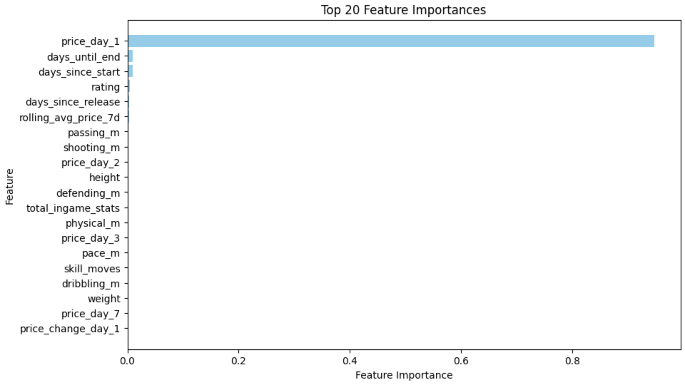
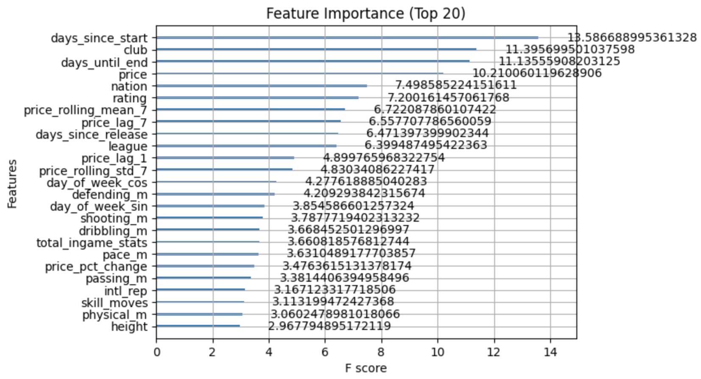
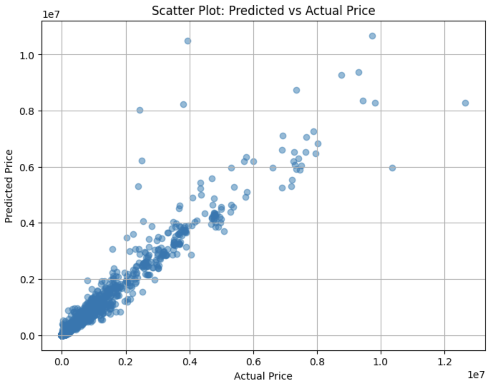

****FUTBIN Price Prediction Project****

**Author:** Vinayak Sankaranarayanan

**GitHub Repository:** [Futbin-Price-Prediction](https://github.com/vinaySankar2004/futbin-price-prediction)

**1\. Project Purpose**

The FUTBIN Price Prediction Project develops a machine learning model to forecast price trends for all FC25 Ultimate Team (FUT) player cards using historical data from FC25, FC24, FIFA 23, and FIFA 22. The project aims to identify short-term fluctuations and long-term lifecycle trends, independent of external short-term factors like SBCs and promos. Leveraging multi-year data provides insights into market behavior, helping users make informed investment decisions efficiently.

**Methodology**

The project involves:

- **Data Collection** – Scraping player attributes and historical price data from **FUTBIN** across **FC24, FIFA 23, and FIFA 22**.
- **Data Processing** – Cleaning, structuring, and storing data in a **MySQL database** for efficient querying.
- **Feature Engineering** – Identifying key variables such as **player stats, playstyles, market trends, and time-based patterns**.
- **Model Selection** – Testing and comparing multiple models (**XGBoost, LSTM, CNN**) to determine the best fit.
- **Evaluation** – Validating model accuracy using real-world data and refining hyperparameters.

**3\. Data Collection**

**Initial Data Scraping**

- Used **Selenium, Chromium, and BeautifulSoup** to automate FUTBIN scraping.
- Extracted player data with the following columns:
  - **Name, ID, Version, Rating, Positions, Price, Foot, Skill Moves, Weak Foot, Work Rate, Pace_M, Acceleration, Sprint Speed, Shooting_M, Att Position, Finishing, Shot Power, Long Shots, Volleys, Penalties, Passing_M, Vision, Crossing, FK Acc, Short Pass, Long Pass, Curve, Dribbling_M, Agility, Balance, Reactions, Ball Control, Dribbling, Composure, Defending_M, Interceptions, Heading Acc, Def Aware, Stand Tackle, Slide Tackle, Physical_M, Jumping, Stamina, Strength, Aggression, Playstyles, Height, Weight, Body Type, Accelerate, Popularity, Total In-game Stats, URL, Nation, League, Club, Intl. Rep**
- Stored data in **CSV format**.

**Daily Price Scraping**

- Scraped daily price fluctuations for players from release to the end of the game cycle.
- Data stored in **CSV files** with columns: **Player ID, Date, Price**.
- Player ID repeats for each day since release, recording the corresponding price at **12 AM** each day.

**4\. Feature Engineering**

**Initial Feature Set**

- **Player attributes** (pace, shooting, passing, etc.).
- **Playstyles** (one-hot encoded where 2 = playstyle plus, 1 = playstyle, 0 = no playstyle).
- **Market dynamics** (initial price, fluctuations, demand patterns).
- **Time-based features** (day of release, promotions, weekend league effects).

**Refinements & Changes**

- Initially, **one-hot encoding of playstyles** was tested but led to sparsity issues.
- Added **rolling averages and exponential moving averages (EMA)** for smoother price trend modeling.

**5\. Model Experiments**

**Initial Experiment: XGBoost with Raw Features**

- **Approach:** Used a select set of features with an **XGBoost model**, setting the target as the **price on the 7th day** and incorporating time-lagged data.
- **Challenges:** Model was overly dependent on **price at day 1**, leading to poor generalization.

  

- **Results:**
  - **MAE:** 76,569
  - **RMSE:** 467,064
  - Poor performance indicated the need to redefine the target variable.
- **Next Steps:** Shifted target to **price percent change** to reduce reliance on absolute price values.

  

**Refining the Approach: Time-Series Representation**

- **Change:** Instead of treating rows as independent, restructured data as a **time-series problem**.
- **Filtering Data:** Removed extreme price changes (>100%) to exclude external market disruptions.
- **Reference:** Based on practices from [Kaggle time-series forecasting](https://www.kaggle.com/code/nicholasjhana/multi-variate-time-series-forecasting-tensorflow).

**Second Model: Deep Neural Network (DNN)**

- **Approach:** Built a **DNN model** with fully connected layers.
- **Challenges:**
  - Struggled with time-dependency despite capturing nonlinear patterns.
  - Test MAE: ~30,000
- **Results:** Showed slight improvement but still lacked strong sequential learning.

  

**Third Model: Convolutional Neural Network (CNN)**

- **Approach:** Used a **CNN model** to extract spatial patterns from sequential data.
- **Challenges:**
  - Handled some temporal structure but lacked long-term memory.
  - Performance was similar to the DNN with a **Test MAE of ~30,000**.

**Fourth Model: LSTM (Long Short-Term Memory)**

- **Approach:** Implemented an **LSTM model** to capture sequential dependencies.
- **Challenges:**
  - Large dataset increased computation time.
  - Sensitive to short-term price volatility.
- **Results:**
  - Best performance in tracking **long-term price trends**.
  - Still struggled with external short-term fluctuations.

**Fifth Model: CNN-LSTM Hybrid**

- **Approach:** Combined **CNN layers** for feature extraction with **LSTM layers** for temporal learning.
- **Results:**
  - Balanced feature learning and sequential modeling.
  - Improved robustness in detecting market trends.

**Bonus Experiment: XGBoost Classification Model**

- **Approach:** Trained an **XGBoost classifier** to predict whether a card’s price would **increase or decrease after 7 days**.
- **Results:**
  - **FC24 + FC25 Data:** **75% accuracy**.
  - **Older FIFA Versions Combined:** **63% accuracy** (better than random guessing!).

**Final Insights & Next Steps**

- **LSTM and CNN-LSTM performed the best** in capturing price trends.
- The **XGBoost classifier showed potential** in binary price direction prediction.
- Future work includes:
  - Experimenting with **Transformers** for improved time-series forecasting.
  - Integrating **external event data** to refine predictions.
  - Further **hyperparameter tuning** to enhance accuracy.

**6\. Conclusion**

The **FUTBIN Price Prediction Project** has evolved through multiple iterations, refining its data collection, feature engineering, and model selection to enhance short-term price forecasting accuracy. While LSTMs have proven effective, further improvements in event-driven modeling and alternative deep learning architectures will enhance prediction reliability and real-world applicability.

**7\. Contact**

For any questions or collaborations, feel free to reach out via **GitHub Issues** or [LinkedIn](http://linkedin.com/in/vinayak-sankaranarayanan/).
